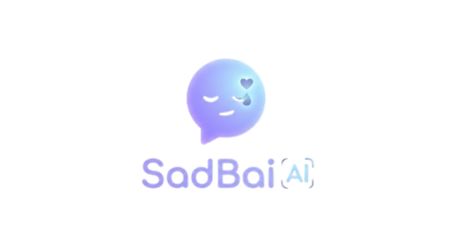

  

# SadBai AI | Your Emotional Companion

SadBai AI is a place where you can find comfort during your heavy moments. It is designed to be a safe space where you can talk, listen, and breathe through your emotions.

---

## How it Helps

### Talk to Someone
The Chat feature allows you to speak with an understanding AI companion. Whether you want to express your feelings in Bisaya, Tagalog, or English, it is here to listen and provide support without any judgment.

### Listen and Ground Yourself
The Sonic Sanctuary is a curated music space. We have gathered some of the most resonant sounds and "what if" tracks from TikTok to help you process what you're going through. Simply select a mode that matches your mood—whether you're feeling sad, moving on, or just need some quiet—and the music will help ground you.

### Take a Moment to Breathe
If things feel overwhelming, use our Guided Breathing tool. It provides a simple visual guide to help you slow down your breathing and find your center.

### Send and Receive Support
The Solidarity Hub is a way to feel connected to others. You can send virtual "hugs" to show support for everyone else using the platform, and see how much love the community is sharing.

---

## About the Project
SadBai was built as a rapid-response project in just 24 hours. While the system was created quickly, the goal has always been to provide a meaningful and therapeutic space for those going through difficult times. We appreciate your patience as we continue to improve the experience.

---

## Connect with the Developer
Created by Javier Siliacay.
- Facebook: facebook.com/siliacayjavier
- Instagram: www.instagram.com/itsyaboi_vier
- GitHub: github.com/javiersiliacay

 

  
  

---
*Take your time. Keep breathing. You are not alone.*